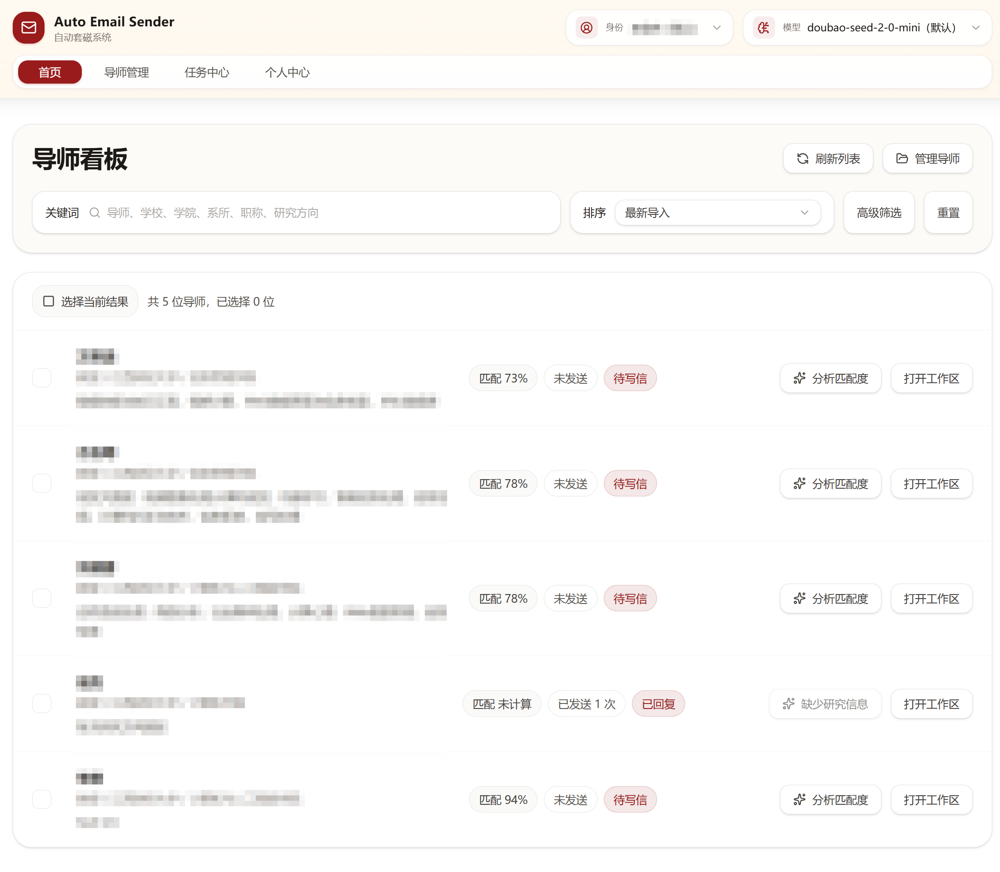
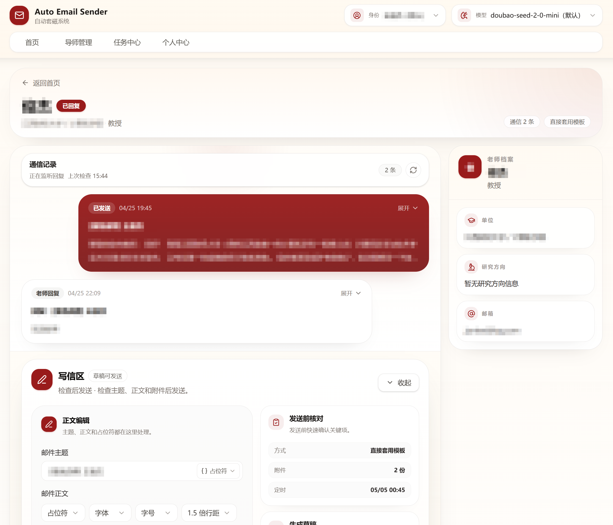
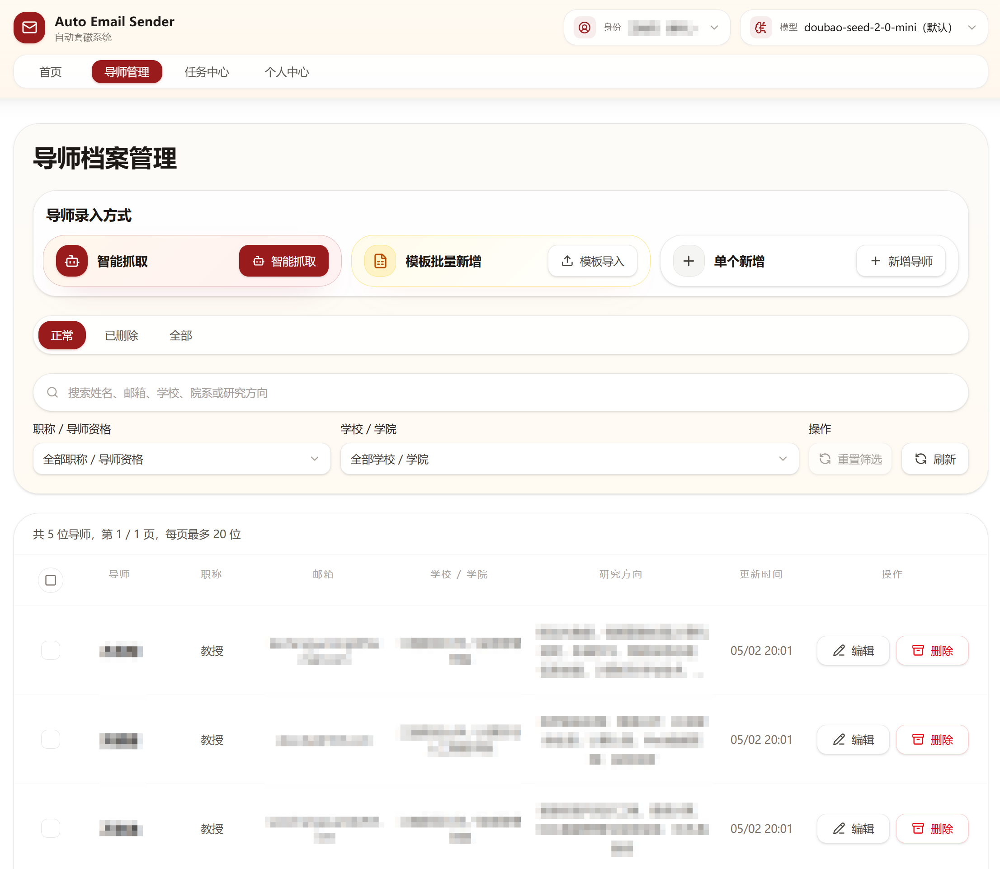
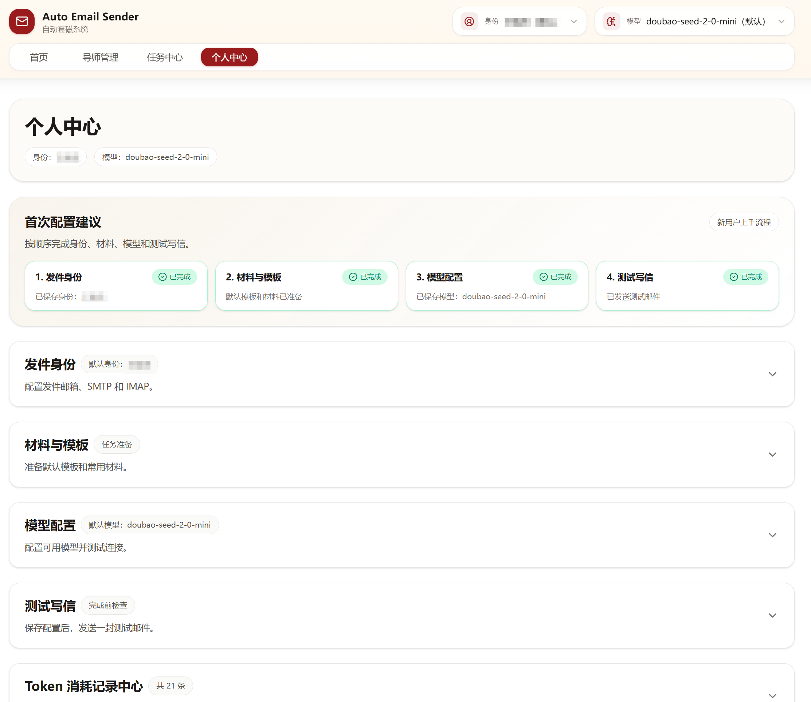

  
  <h1>Auto Email Sender</h1>
  

    <strong>面向导师套磁场景的智能邮件助手</strong>
  

  

    
    
    
    
  

---

> 利用 Agent 从学校导师页智能抓取导师信息，结合 LLM 分析匹配度，进行模板改写、定时批量发送和回复追踪。

Auto Email Sender 是一个本地运行的导师联系工具。它把导师抓取、匹配分析、邮件草稿、定时批量发送和回复追踪放在同一个流程里，适合需要批量联系导师、但又不想直接“无脑群发”的场景。

系统会帮你减少整理和重复写信的工作，但最终发给谁、什么时候发、发什么内容，仍然由你来定。

## 界面预览

| 首页                                                   | 工作区                                                     |
| ------------------------------------------------------ | ---------------------------------------------------------- |
|  |  |

| 导师管理                                                         | 个人页                                                       |
| ---------------------------------------------------------------- | ------------------------------------------------------------ |
|  |  |

## 入口

- [官网](https://juniexd.github.io/AutoEmailSender/)
- [文档](https://juniexd.github.io/AutoEmailSender/docs/getting-started)
- [下载 Windows 安装包](https://github.com/JunieXD/AutoEmailSender/releases)
- [问题反馈](https://github.com/JunieXD/AutoEmailSender/issues)

## 核心特点

| 特点         | 说明                                                      |
| ------------ | --------------------------------------------------------- |
| 智能抓取     | 利用 Agent 从学校官网整理导师信息，减少手动复制和表格维护 |
| 匹配度分析   | 通过 LLM 结合你的材料和导师资料，辅助判断联系优先级       |
| 定时批量发送 | 草稿确认后，可以立即发送，也可以安排到指定时间批量发送    |
| 回复追踪     | 自动检测导师回复，方便后续跟进                            |

## 页面概览

| 页面       | 用途                           |
| ---------- | ------------------------------ |
| 首页       | 筛选导师，创建联系任务         |
| 导师管理   | 抓取、导入和维护导师信息       |
| 任务中心   | 查看批量任务和发送计划         |
| 工作区     | 查看匹配结果，审核草稿并发送   |
| 个人页     | 配置发件身份、材料、模板和邮箱 |
| 测试写信页 | 先给自己发一封测试邮件         |

## 未来计划

- [ ] 安卓移动端适配
- [ ] 降低导师信息抓取消耗token数量
- [ ] 减小 Windows 安装包体积

## License

GPL-3.0

## Star History

